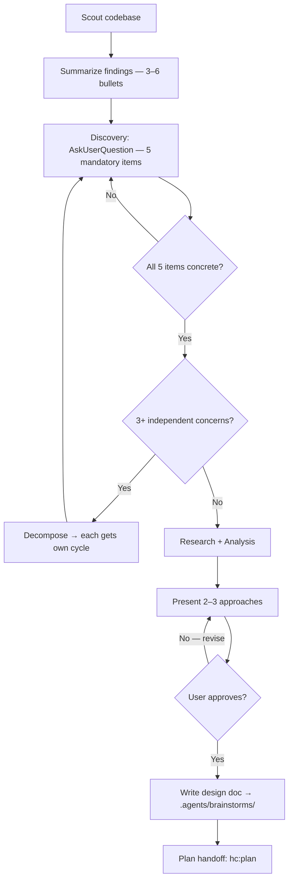

# hl:brainstorm — Solution Design

Default: analyze problem → auto-select persona + edge dimensions → targeted answer. Explicit flags override auto-selection. **Principles:** YAGNI · KISS · DRY.

## Usage

```
{skill:hl-brainstorm} <problem>                 # auto-detect persona + relevant edges
{skill:hl-brainstorm} --[persona] <question>    # single persona consultation
{skill:hl-brainstorm} --debate "<proposal>"     # all 9 personas → GO/CAUTION/STOP
{skill:hl-brainstorm} --edges "<feature>"       # 12-dimension edge analysis only
{skill:hl-brainstorm} --debate --edges "<prop>" # full: all personas + edge sweep
```

| Flag | Behavior |
|------|----------|
| *(none)* | Auto-select 1–2 personas + 3–5 edge dimensions from problem context; answer immediately |
| `--architect` | System structure and evolvability (can zoom into engineering details) |
| `--scientist` | Empirical validation and measurement (applies rigour at any level) |
| `--social-scientist` | Human and org behavior (individual → societal scale) |
| `--philosopher` | Logical consistency + systems thinking (meta-level, questions any assumption) |
| `--economist` | Incentives, opportunity cost, resource allocation (micro → macro) |
| `--strategist` | Long-term positioning and competitive dynamics (product → business) |
| `--creative-director` | Creative vision and experience integrity, encompasses Designer lens |
| `--manager` | Org and team capacity, encompasses Operator lens (reliability, blast radius) |
| `--devil` | Adversarial meta-level — challenges premise itself; no constraints on scope |
| `--debate` | All 9 personas analyze independently → GO / CAUTION / STOP verdict |
| `--edges` | 12-dimension edge case sweep |

**Persona consultation** (`--[persona]`): answer immediately through that lens — no 5-item discovery, no plan handoff.

**Scope range rule:** higher-level personas can zoom into lower-level concerns when relevant; lower-level personas cannot zoom out beyond their natural scope.

## Constraints

> **Required — recon-first (full mode only):** When no persona flag and problem requires codebase context, scan with `{skill:hc-scout}` first. Report 3–6 bullets, then proceed.

> **Required — no implementation:** Do not write code or invoke implementation skills until the user has approved a design.

## Process — Default Mode (auto-detect)

When invoked without flags, auto-route based on problem keywords:

| Problem signals | Auto-selected personas | Auto-selected edge dimensions |
|-----------------|----------------------|------------------------------|
| system design, architecture, coupling | Architect | Scale, State Transitions |
| auth, security, credential, token | Manager + Scientist | Authorization, Data Integrity |
| schema, migration, database | Architect + Scientist | Data Integrity, Scale |
| slow, latency, performance, bottleneck | Architect | Scale, Timing |
| user, adoption, team, onboarding | Social Scientist + Creative Director | User Types, Environment |
| cost, budget, pricing, ROI, incentive | Economist + Strategist | Business Logic, Scale |
| should we, worth it, tradeoff, decision | Philosopher + Strategist | Compliance, Business Logic |
| incident, production, outage, failure | Manager + Devil | Error Cascades, Timing |
| UX, experience, design, interface | Creative Director | User Types, Environment |
| strategy, market, positioning, compete | Strategist + Economist | Business Logic, Integration |
| LLM, agent, token, context window, memory, multi-agent | Architect | Scale, State Transitions |

Apply the selected lenses immediately. Output: persona analysis → relevant edge cases found → recommendation.

## Process — Full Brainstorm (explicit topic, no persona flag, complex scope)



**Mandatory items to capture before proposing:**
1. Expected output — what artifact(s) will exist at the end?
2. Acceptance criteria — how will the user verify? (specific behaviors, edge cases that must work)
3. Scope boundary — what is explicitly out of scope?
4. Non-negotiable constraints — stack, file locations, naming, compatibility.
5. Touchpoints — which existing files/modules will this touch?

**Research tools:** `{skill:hc-lookup}` · `{skill:hl-reasoning}` · `WebSearch` · `psql` · `haily-planner` agent

**Plan handoff options:**

| Option | Recommend when | Why |
|--------|----------------|-----|
| `{skill:hc-plan} --tdd` | Refactoring existing behavior or critical logic | Locks behavior before changes |
| `{skill:hc-plan}` | Standard new feature | Phase-by-phase plan |
| End session | User wants to plan later | Skip planning step |

## Personas

Each persona has a **natural vantage point** and a **scope range** — higher personas can zoom into lower-level concerns; lower personas cannot zoom out beyond their scope.

| Persona | Vantage | Scope range | Signature question | Finds |
|---------|---------|------------|-------------------|-------|
| **Architect** | System structure | System → Component | "What structure allows this system to evolve without breaking?" | Hidden coupling, bottleneck interfaces, structural anti-patterns |
| **Scientist** | Empirical evidence | Cross-level | "How do we know this works? What would disprove it?" | Untestable claims, missing metrics, confirmation bias |
| **Social Scientist** | Human & org behavior | Individual → Societal | "How will people actually behave — not how we think they will?" | Adoption failure, workaround culture, 2nd-order org effects |
| **Philosopher** | Logic + systems thinking | Meta — any level | "Is our reasoning consistent? What are we assuming is obvious?" | Hidden assumptions, circular reasoning, definitional ambiguity, systemic blind spots |
| **Economist** | Incentives & resources | Micro → Macro | "What incentives does this create? What is the real opportunity cost?" | Perverse incentives, resource misallocation, unintended trade-offs |
| **Strategist** | Long-term positioning | Product → Business | "What position does this create in 18 months? Where is the lock-in?" | Competitive effects, tech debt as strategy, irreversible constraints |
| **Creative Director** | Creative vision & experience integrity | Concept → UX Detail | "Does this have a coherent vision? Is it memorable? Does it have soul?" | Experience incoherence, aesthetic drift, unnecessary complexity, design smell |
| **Manager** | Org & team capacity + operations | Decision → Ops Detail | "What does this cost in velocity, cognitive load, and trust? What fails at 3am?" | Hidden maintenance cost, team morale risks, reliability gaps, observability blind spots |
| **Devil** | Adversarial meta-level | Everything — no constraints | "If the entire premise is wrong, what would a madman do instead?" | Fatal premise flaws, radical alternatives, "burn and rebuild" scenarios |

## --debate Mode

All 9 personas analyze the proposal independently. No edge sweep unless `--edges` is added.

```
{skill:hl-brainstorm} --debate "<proposal>" [--files <glob>]
{skill:hl-brainstorm} --debate --edges "<proposal>"    # full: personas + edge sweep
```

**Use before:** major/high-risk features, significant refactors, architecture changes.
**Skip when:** trivial changes, pure dep upgrades with no API changes.

### Debate Protocol

1. Each persona analyzes independently (no cross-influence)
2. Identify agreements (6+ personas align) and conflicts
3. Weigh trade-offs by impact
4. Produce verdict: **GO** · **CAUTION** · **STOP** with actionable recommendations

**STOP triggers (any one):** auth bypass · fundamental design incompatibility · unacceptable query explosion · false assumption invalidating the approach · no viable rollback · untestable hypothesis · systemic adoption blocker.

### Debate Output

```
## Debate Report: [proposal]
## Verdict: GO | CAUTION | STOP
### Agreements (6+ personas align)
### Conflicts & Resolutions (Topic | persona views | Resolution)
### Risk Summary (Risk | Severity | Mitigation)
### Recommendations
```

## --edges Mode

Standalone 12-dimension edge case analysis. Can combine with `--debate`.

| # | Dimension | What to surface |
|---|-----------|----------------|
| 1 | **User Types** | admin, guest, banned, new user, power user, bot/scraper |
| 2 | **Input Extremes** | empty, null, max length, unicode, special chars, injection |
| 3 | **Timing** | concurrent access, race conditions, timeout, retry storms |
| 4 | **Scale** | 0 items, 1 item, 1M items, pagination boundary |
| 5 | **State Transitions** | first use, mid-flow abort, resume after crash |
| 6 | **Environment** | mobile/low-end CPU, no JS, proxy/VPN, locale |
| 7 | **Error Cascades** | DB down, API timeout, disk full, network partition |
| 8 | **Authorization** | expired token, wrong role, CORS, CSRF, privilege escalation |
| 9 | **Data Integrity** | duplicate entries, orphan refs, encoding mismatch |
| 10 | **Integration** | webhook replay, API version mismatch, third-party outage |
| 11 | **Compliance** | GDPR deletion, audit logging gap, accidental PII exposure |
| 12 | **Business Logic** | zero/negative values, coupon stacking, free tier limits |

Filter to relevant dimensions; skip irrelevant ones explicitly. Output: dimension table + severity classification (Critical/High/Medium/Low).

## --ultra Mode

Active only when the turn was started via `{skill:hl-ultra}` (it passes the internal `--ultra` marker) — never self-activated, never suggested. Turn-scoped: every skill in the chain sees it. If the user types `--ultra` directly, redirect to `{skill:hl-ultra}` — a bare flag escalates subagents only while the main loop stays on the session model.

- Task calls to deep-eligible agents (`haily-planner`, `haily-implementor`, `haily-reviewer`, `haily-brainstormer`, `haily-debugger`) pass `model: {model:deep}`.
- All other agents keep their pinned tiers — escalate judgment, not mechanics.
- If the deep model is unavailable, retry once with the thinking tier and tell the user which model ran.

## Workflow Position

**Follows:** `{skill:hc-debug}`, `{skill:hc-scout}`
**Precedes:** `{skill:hc-plan}` — plan the agreed solution
**Related:** `{skill:hl-reasoning}`, `{skill:hl-research}`
**For LLM context design:** follow with `{skill:hl-context-engineering}` when the topic involves token limits, agent memory, or multi-agent coordination
